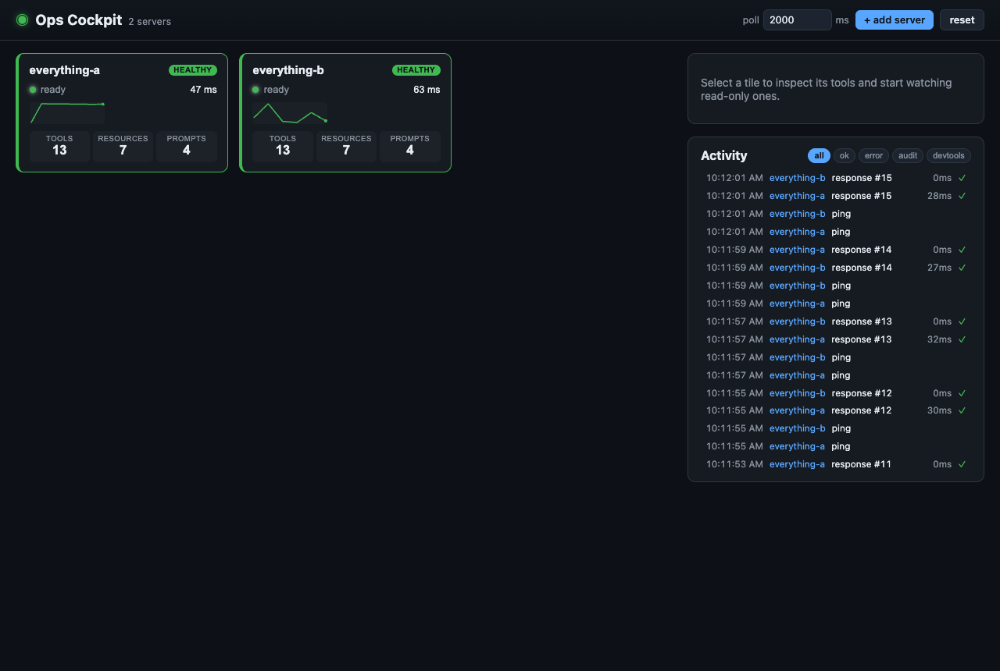
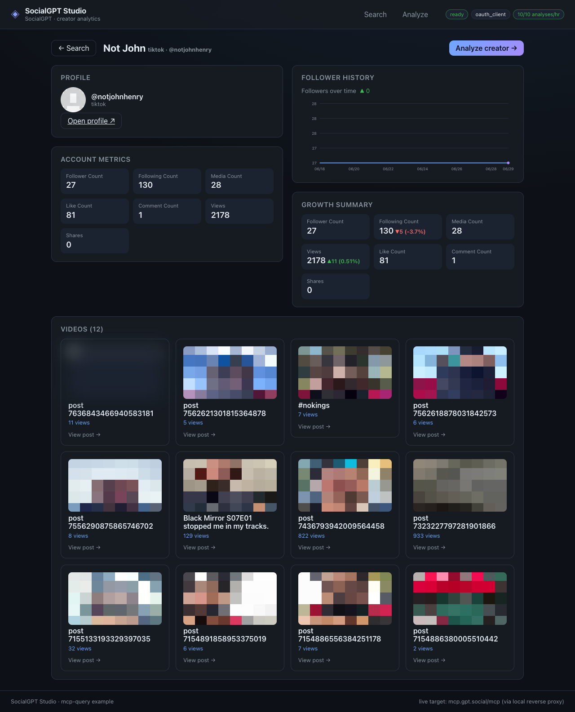
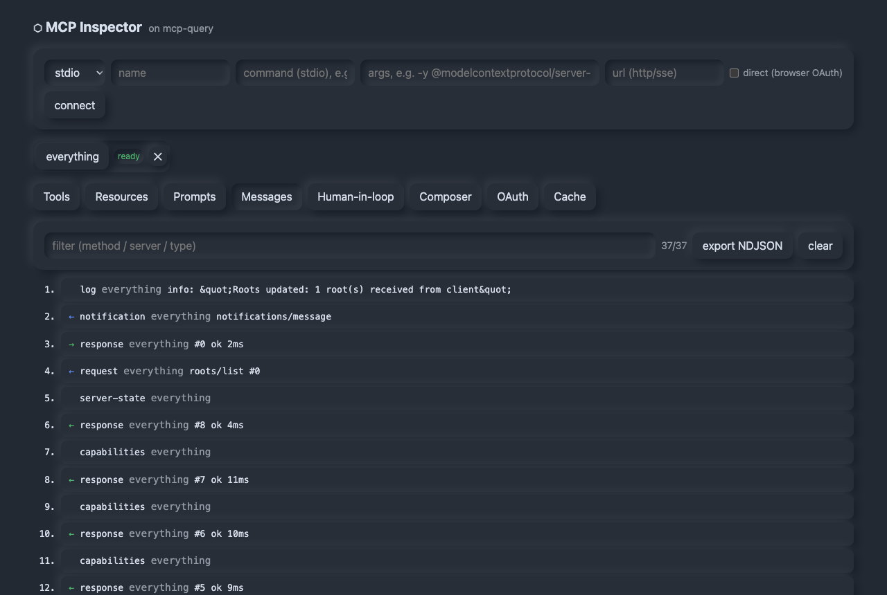

# mcp-query ecosystem

A data-layer ecosystem for the **Model Context Protocol** — a reactive client and the
governance, testing, and fixture tooling built around it. Same shape as the GraphQL world
(Apollo Client + a gateway + schema checks + mocking), but for MCP.

This repo is an npm-workspaces monorepo. The packages share one core (`mcp-query`) and
compose along a clean seam (an interceptor chain + a transport tap), so each does one job
and they stack:

```
                          ┌─────────────────────────────────────────────┐
 your app / agent host ──▶│                 mcp-query                    │──▶ MCP servers
                          │   reactive client · cache · codegen · core   │
                          └─────────────────────────────────────────────┘
                                              ▲
      ┌──────────┬──────────┬──────────┬───────┴──┬──────────┬──────────┐
 ┌─────────┐ ┌────────┐ ┌────────┐ ┌────────┐ ┌────────┐ ┌────────┐
 │ mcp-gate│ │contract│ │  lint  │ │  docs  │ │  bench │ │ record │
 │ govern  │ │ guard  │ │ lint   │ │generate│ │ measure│ │ freeze │
 │ runtime │ │ drift  │ │ quality│ │ref docs│ │ latency│ │ traffic│
 └─────────┘ └────────┘ └────────┘ └────────┘ └────────┘ └────────┘
              └──────── share capture / connect (the surface) ───────┘
```

## Packages

| Package | What it does | When you reach for it |
|---|---|---|
| **[@mcp-query/cli](packages/cli)** | The unified **`mcpq`** CLI: one entry point over every tool below (`mcpq lint`/`docs`/`bench`/…), **plus a server registry** (`mcpq add`, honoring the `.mcp.json`/`mcpServers` standard) and **client verbs** (`mcpq tools`/`call`/`read`) to drive any registered server. | You want **one command** for the whole toolkit and to call your MCP servers by name from the terminal. |
| **[mcp-query](packages/mcp-query)** | The reactive, cached, embeddable MCP **client**: TanStack-Query-style document cache, RTK-Query tags, LSP-client lifecycle, React hooks, codegen, an interceptor chain, and optional server-side modules (gateway, metrics, OTel, sessions, Redis L2). | You're **consuming** MCP servers from an app or backend and want a real data layer, not raw SDK calls. |
| **[@mcp-query/gate](packages/mcp-gate)** | A config-driven **security/policy proxy**. Fronts many upstreams as one governed endpoint: declarative authorization, DLP redaction, rate-limit, circuit-breaking, audit. | You're handing MCP servers to an agent and need a **runtime choke point** — allow/deny, scrub secrets, log everything. |
| **[@mcp-query/contract](packages/mcp-contract)** | **Contract testing / drift detection.** Pin a server's capability surface, then fail CI when a live server changes incompatibly (with proper input/output variance). The dual of codegen. | You generated/wrote code against an MCP server and want CI to **catch breaking drift** before it ships. |
| **[@mcp-query/lint](packages/mcp-lint)** | **Quality lint** (ESLint for MCP). Check a single surface against design rules — descriptions, annotations, typed inputs, naming — and gate CI on it. | You're **authoring** an MCP server and want a quality bar enforced in CI. |
| **[@mcp-query/docs](packages/mcp-docs)** | **Reference docs** (Redoc for MCP). Render Markdown docs from a live server or a contract: tool arg tables, annotation badges, resources, prompts. | You want **always-current reference docs** for an MCP server, generated not hand-written. |
| **[@mcp-query/bench](packages/mcp-bench)** | **Benchmarking.** Latency (p50/p95/p99) + throughput per tool, with perf budgets that fail CI. Local or hosted servers. | You want to **track an MCP server's performance** or gate on a latency budget. |
| **[@mcp-query/record](packages/mcp-record)** | **Record / replay** (VCR for MCP). Capture real server traffic to a cassette, replay it offline as a deterministic mock. | Your tests/demos need a server's **real output** but fast, offline, and frozen. |

## Apps

Reference applications that prove you can build real product UIs on MCP — each chosen to
exploit a different MCP-native capability REST/GraphQL lack. They share a spine (`apps/shared`:
the WS proxy, transport, OAuth, schema-form, and React glue).

| App | What it shows | Stack |
|---|---|---|
| **[inspector](apps/inspector)** | Protocol **debugger** — raw message log, manual sampling, OAuth stepper, cache view | Web Components |
| **[socialgpt-studio](apps/socialgpt-studio)** | **One backend, two consumers** — a creator-analytics UI over the live OAuth-gated [SocialGPT](https://mcp.gpt.social/mcp) tool surface an agent also uses | React, **Deno desktop** (+ token-injecting backend proxy) |
| **[console](apps/console)** | **Capability discovery** — a polished operator UI auto-generated from *any* server's tools/resources/prompts | Web Components |
| **[ops-cockpit](apps/ops-cockpit)** | **Aggregation + live tiles** — a NOC dashboard over many servers, reactive on health + `list_changed` | React |
| **[approvals](apps/approvals)** | **Human-in-the-loop** — agent sampling/elicitation proposals approved/edited in a queue, on the `InteractionBroker` | React |
| **[notebook](apps/notebook)** | **Subscriptions** — a notes UI where agent and app share one live view via `resources/subscribe` | React |
| **[composer](apps/composer)** | **Tools as *input*** — a chat where the *user* drives MCP tools to assemble grounded input (the inverse of agentic tool use), with a pluggable model picker via [ai.matey](https://github.com/johnhenry/ai.matey) | React |

Browser apps reach stdio servers through `apps/shared`'s WebSocket proxy (the `dev` script runs
it alongside Vite); the React apps dogfood `mcp-query`'s React hooks, the Web-Components apps the
framework-agnostic core.

<table>
  <tr>
    <td width="50%" valign="top">
      <a href="apps/ops-cockpit"></a><br>
      <b><a href="apps/ops-cockpit">ops-cockpit</a></b> — a NOC dashboard with live health tiles over many servers at once.
    </td>
    <td width="50%" valign="top">
      <a href="apps/socialgpt-studio"></a><br>
      <b><a href="apps/socialgpt-studio">socialgpt-studio</a></b> — creator analytics over a live, OAuth-gated MCP server.
    </td>
  </tr>
  <tr>
    <td width="50%" valign="top">
      <a href="apps/inspector"></a><br>
      <b><a href="apps/inspector">inspector</a></b> — a protocol debugger with the raw JSON-RPC message log.
    </td>
    <td width="50%" valign="top">
      <a href="apps/composer"></a><br>
      <b><a href="apps/composer">composer</a></b> — tools as <i>input</i>: a user-driven, grounded chat.
    </td>
  </tr>
</table>

> Each app's README has a full Screenshots section.

## How they relate

- **One core, composable seams.** `mcp-gate` is just `mcp-query`'s `MCPClient` behind its
  `createGateway`, with an interceptor stack. `mcp-record` taps the same `instrumentTransport`
  seam the devtools use. `mcp-contract`'s mock and `mcp-record`'s replay both build on the
  shared `MockMCPServer`.
- **One capture, four uses.** `mcp-contract` captures a server's surface; `mcp-lint` and
  `mcp-docs` reuse that same `captureContract` — to *grade* the surface and to *document* it.
  Pin it (contract), lint it (lint), document it (docs).
- **contract vs lint:** contract is **relative** (did it change incompatibly between two
  versions?); lint is **absolute** (is this one version well-designed?). Run both in CI.
- **contract vs record:** a *contract* pins the **shape** (schemas/annotations) to catch drift;
  a *cassette* freezes the **real results** for offline replay. Use both — contract in CI,
  cassettes in tests.

## The `mcpq` CLI

One entry point over the whole toolkit, a server registry, and a terminal MCP client:

```bash
# register a server once (stdio or hosted; honors ~/.mcp-query/servers.json + project .mcp.json)
mcpq add everything --command npx --args "-y @modelcontextprotocol/server-everything"
mcpq add linear https://mcp.linear.app/mcp        # hosted
mcpq login linear                                  # browser OAuth (DCR+PKCE), token cached + auto-refreshed
mcpq servers                                       # list them
mcpq import claude                                 # pull servers from Claude/Cursor/VS Code configs

# drive any registered server (by name) from the terminal
mcpq tools everything                              # list tools as typed signatures
mcpq call everything echo --message hi             # flag style …
mcpq call everything 'get-sum(a: 2, b: 40)'        # … or function-call style (coerced by inputSchema)
mcpq read everything file:///x   ·   mcpq ping everything
mcpq session everything                            # interactive REPL on ONE live connection
mcpq call --daemon everything echo --message hi    # keep-alive daemon reuses the connection
mcpq daemon status   ·   mcpq daemon stop          # across invocations (great for stateful stdio servers)

# every tool is a verb — and accepts a registered name
mcpq lint everything   ·   mcpq docs linear --out API.md   ·   mcpq bench everything --call echo:'{}'
mcpq contract snapshot everything --out api.json   ·   mcpq gate ./gate.config.ts
```

`.mcp.json`/`mcpServers` configs from Claude, Cursor, and VS Code are read natively (no secrets
stored — OAuth lives in `~/.mcp-query/oauth/`). The individual `mcp-*` bins still work standalone.

## Develop

```bash
npm install                 # install all workspaces

npm test                    # run every workspace's test suite
npm run build               # build the publishable mcp-query package (dist/)
npm run typecheck           # typecheck all workspaces

# work in one package
npm test -w mcp-query
npm test -w @mcp-query/gate
npm run dev -w @mcp-query/inspector
```

In this monorepo the satellite packages consume `mcp-query` directly from its TypeScript
**source** (`packages/mcp-query/src`) for a zero-build dev loop; only `mcp-query` itself
emits a `dist/` for publishing.

## Status

`mcp-query` is the publishable core (`0.0.1`); the gate / contract / lint / docs / bench /
record packages and the inspector are MVPs (`private`) tracking it. See each package's README
for specifics.

## License

[MIT](LICENSE)
