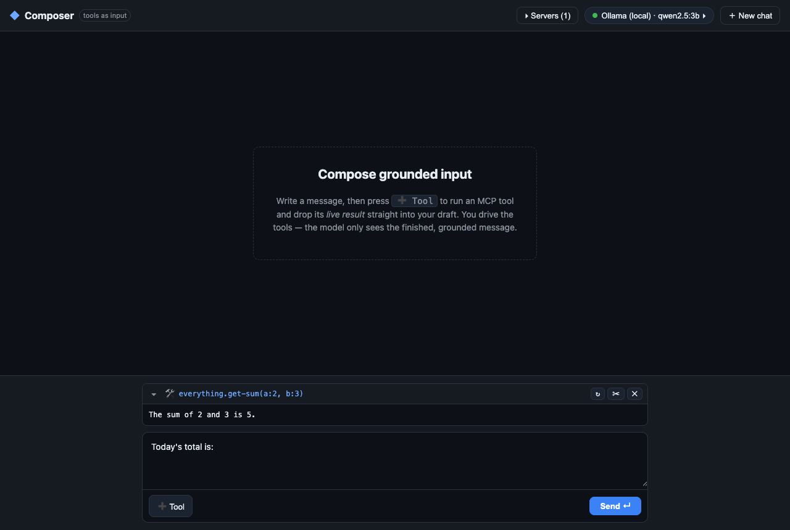
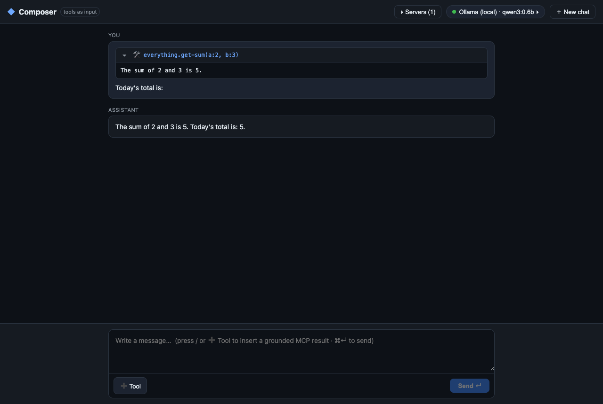
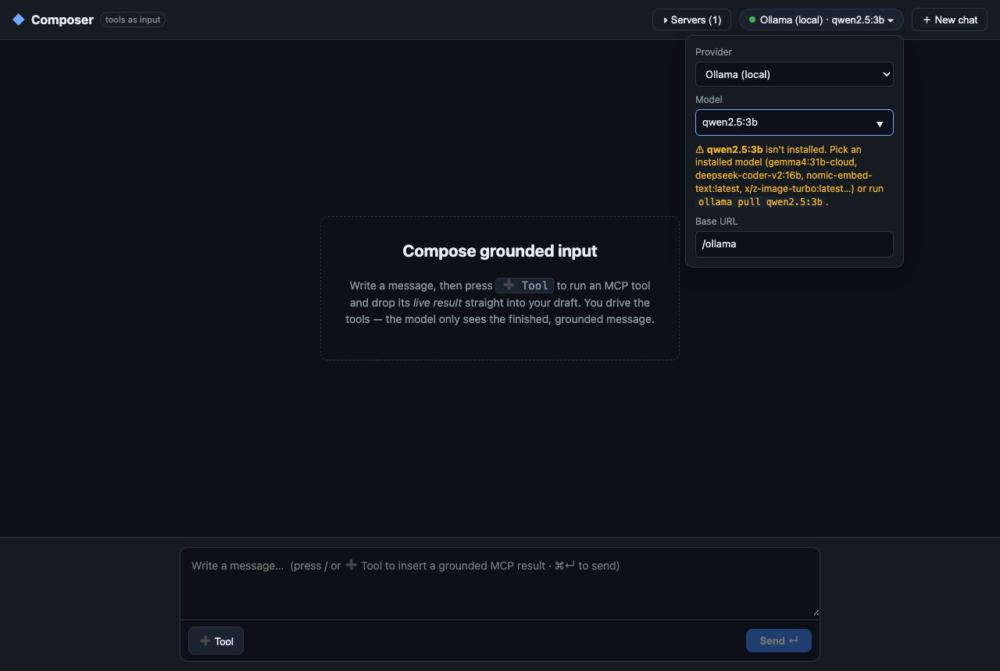

# @mcp-query/composer

**Tools as input, not agent output.**

Composer is a chat app that inverts the usual agent loop. Instead of the model deciding
when to call MCP tools, **you** drive the tools yourself — running them in the composer,
inspecting the live results, trimming/editing them — and only then sending the finished,
**grounded** message to the model. The model never sees a tool; it sees the assembled,
factual input you handed it.

This makes the MCP layer a *grounding* layer for human-authored prompts: pull a number
from a calculator tool, a row from a database tool, the text of a resource — drop each
straight into your draft as an editable block, then send.

## The idea

```
┌─ Composer (you) ───────────────────────────────┐
│  "here is today's total:"                       │
│  ┌─ 🛠 everything.get-sum(a:2, b:3) ──────────┐ │   ← you ran this tool
│  │ 5                                          │ │     (re-run / trim / remove)
│  └────────────────────────────────────────────┘ │
│  "is that within budget?"                        │
└──────────────────── Send ───────────────────────┘
                        │
                        ▼  assembled into ONE grounded user message
   here is today's total:

   ‹tool everything.get-sum(a:2, b:3)›
   5

   is that within budget?
                        │
                        ▼  streamed to the model of your choice
                  assistant reply…
```

- **Thread** (top): the conversation. User messages render the freeform text + the grounded
  blocks they carried (collapsible, read-only). Assistant replies stream in.
- **Composer** (bottom): a textarea plus a **➕ Tool** button (or press `/` in an empty
  textarea). Pick a connected server → pick a tool (read-only / destructive badges shown)
  → fill its `inputSchema` → **Run**. The live result is appended as an editable block:
  **re-run** (↻), **trim to text** (✂), **remove** (✕). Resources work the same way.
- **Send** assembles the whole draft into a single grounded user message and streams the
  model's reply into the thread. `⌘↵` / `Ctrl↵` sends.

## Screenshots

**Compose** — run an MCP tool yourself and its live result drops into the draft as an editable block (re-run ↻ / trim ✂ / remove ✕).



**Send** — the whole draft is assembled into one grounded user message and the model's reply streams into the thread.



**Model picker** — pick a provider/model; for Ollama it lists the models actually installed locally and warns when the selected one isn't pulled.



## Running it

Composer talks to MCP servers through the shared WebSocket proxy, and to Ollama through
Vite's dev proxy. One command runs both the proxy and the web app:

```bash
npm run dev -w @mcp-query/composer
```

Then open the printed URL (the proxy token/port are passed on the query string, exactly
like the inspector app). The default server is the reference **everything** server
(`npx -y @modelcontextprotocol/server-everything`), which ships demo tools like
`get-sum`/`echo` and a handful of resources — perfect for trying the tool-block flow.

Other scripts:

```bash
npm run typecheck -w @mcp-query/composer
npm run test      -w @mcp-query/composer   # headless; never hits a model or proxy
npm run build     -w @mcp-query/composer
```

### Servers

Click **Servers** in the header to see live connection state and add/remove servers at
runtime. Add either:

- a **stdio** server — `name` + a command line (e.g. `npx -y @modelcontextprotocol/server-filesystem /tmp`), or
- an **http** server — `name` + a URL (e.g. `https://host/mcp`).

The server list persists to `localStorage`. The client multiplexes all of them, so a
single draft can interleave tool results from different servers.

## The model picker (ai.matey)

Composer is provider-agnostic. It speaks **one** frontend shape (OpenAI Chat Completions)
and swaps the *backend* adapter per provider via the `ai.matey` packages — a
`Bridge(frontend, backend)` translates your uniform request into whatever the chosen
provider expects, then translates the reply back to OpenAI shape.

The header **model pill** lets you pick a provider, a model, and the provider's config.
Everything is stored in `localStorage` only — there is no backend.

| Provider     | Config        | Notes                                                        |
|--------------|---------------|-------------------------------------------------------------|
| **Ollama**   | base URL      | **Default, zero-config.** `/ollama` (Vite proxies → :11434), default model `qwen2.5:3b` (`ollama pull qwen2.5:3b` if not present). The picker lists the models actually installed locally and warns if the selected one isn't pulled. |
| OpenAI       | API key       | hosted                                                      |
| Anthropic    | API key       | hosted; sends the dangerous-direct-browser-access header    |
| Groq         | API key       | hosted                                                      |
| Gemini       | API key       | hosted                                                      |
| Mistral      | API key       | hosted                                                      |
| OpenRouter   | API key       | hosted                                                      |

> **CORS / security note.** Hosted providers are called **directly from the browser** with
> `browserMode` enabled, so your API key lives in `localStorage` and is sent from the tab.
> Many hosted APIs block direct browser calls with CORS, and exposing a key in the browser
> is unsafe for anything but local experimentation. **Ollama-local is the zero-config
> default** and works out of the box on this machine.

## How it's built

| File | Role |
|------|------|
| `src/draft.ts` | Pure domain logic: the `Draft`/`Block` model, the `draftReducer`, and `assembleMessage` (draft → one grounded message string). No React, fully unit-tested. |
| `src/model.ts` | The provider registry + `Bridge` construction. Exposes `chat()` and `streamChat()`; persists the chosen provider + per-provider config. |
| `src/servers.ts` | Persisted MCP server list and `TargetSpec` helpers. |
| `src/components/*` | `Thread`, `Composer`, `ToolPalette`, `BlockView`, `ModelPicker`, `ServerManager`. |
| `src/App.tsx` | Builds the multiplexed `MCPClient` over the proxy, owns the thread + draft, wires Send → assemble → stream. |

The MCP plumbing is reused from `@app-shared`: `makeProxyClient`, `AppProvider`,
`SchemaForm`, `ResultView`, `JsonView`, plus the `mcp-query/react` capability hooks.

## Tests

- `test/draft.test.ts` — pure unit tests of `assembleMessage`, `serializeArgs`,
  `resultToText`, and the `draftReducer` (add / remove / patch / clear).
- `test/integration.test.tsx` — builds a real `MCPClient` over an in-memory
  `MockMCPServer` (`mcp-query/testing`), wraps it in `AppProvider`, and asserts the
  tool-insertion path produces a block carrying the tool's live result, the resource-read
  path, and that re-running updates the block. **No model and no proxy are touched.**
