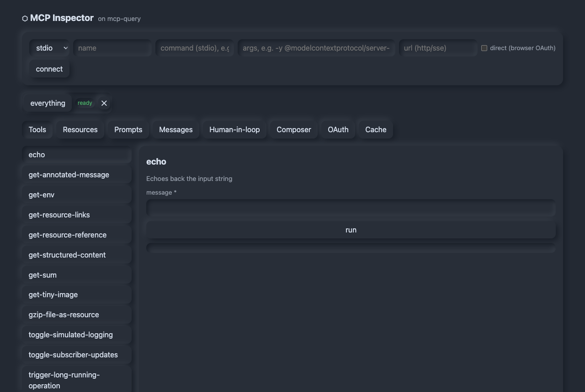
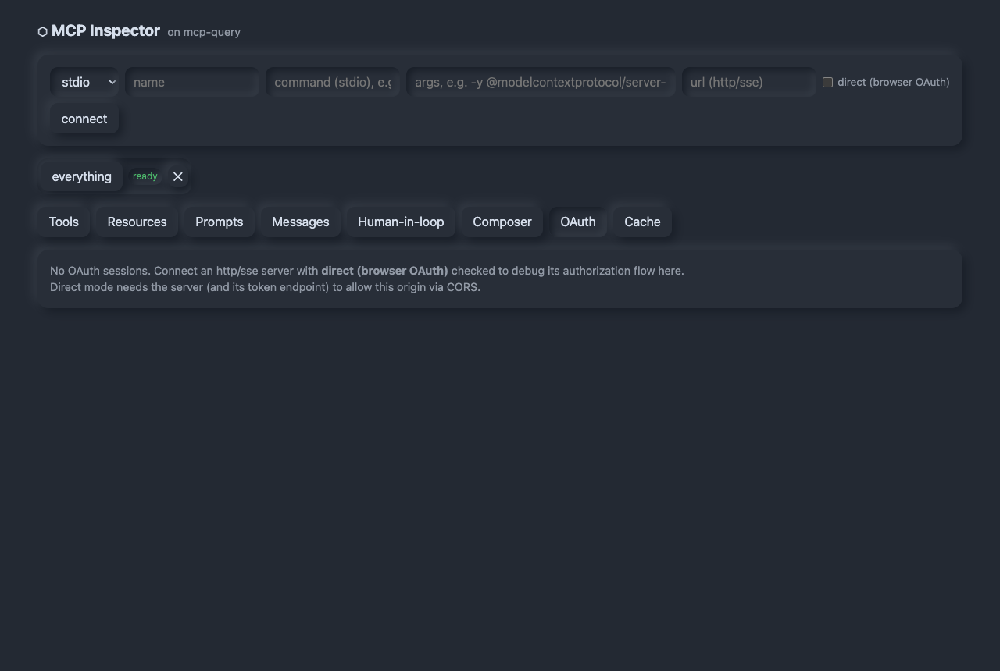

# MCP Inspector (built on mcp-query)

A flagship MCP Inspector — Web Components + Vite, no framework — that **dogfoods
mcp-query's framework-agnostic core** (binding custom elements to `cache.subscribe`,
`subscribeServerState`, `broker.subscribe`, and `DevtoolsHub` via a tiny `Reactive` base,
the Web Components analog of `useSyncExternalStore`). Built per
[modern-web-guidance](https://github.com/GoogleChrome/modern-web-guidance), simple neumorphic.

## Screenshots

**Tools** — schema-driven forms with destructive-confirm; results render inline.



**Messages** — the raw JSON-RPC log: live request/response/notification stream with filtering, NDJSON export, and per-request replay (⟳).


**OAuth** — the browser-side OAuth debugger for http/sse servers (step-through timeline, re-authorize / clear credentials).



## Run

```bash
npm install            # from the monorepo root
npm run dev -w @mcp-query/inspector
# the proxy prints:  → Open: http://localhost:5173/?proxyToken=…
```

Open the printed URL (the `proxyToken` authorizes the browser↔proxy WebSocket). Then add a
server — e.g. stdio `npx` `-y @modelcontextprotocol/server-everything`, or an HTTP/SSE URL.

## Architecture

```
Browser (Vite SPA, Web Components)                 Node proxy (server/proxy.ts)
  mcp-query MCPClient                                bearer token · localhost-only · Origin check
   └─ WebSocketProxyTransport  ── ws ──▶  relays JSON-RPC frames ──▶  stdio / Streamable HTTP / SSE
```

The **proxy** is the one piece mcp-query deliberately leaves out (a browser can't spawn
stdio processes). It bridges the browser to stdio/HTTP/SSE MCP servers and is the only
trusted local component.

- `server/proxy.ts` — the WebSocket↔transport bridge.
- `src/lib/transport.ts` — `WebSocketProxyTransport` (SDK `Transport` over the proxy).
- `src/lib/reactive.ts` — the `Reactive` base element + store-tracking.
- `src/lib/store.ts` — the single `MCPClient`, `InteractionBroker`, `DevtoolsHub`, active-server signal.
- `src/components/*` — `<mcp-connections>`, `<mcp-tools>`, `<mcp-resources>`, `<mcp-prompts>`, `<mcp-app>`.

## Status (phased)

- **Phase 1 (now):** monorepo + proxy + reactive Web Components; multi-server connect; tools
  (schema-driven forms + destructive confirm), resources (live subscribe), prompts (get).
- **Phase 2 (done):** raw JSON-RPC message log — filter, expand, NDJSON export, replay,
  IndexedDB persistence. (Web Worker indexing: future.)
- **Phase 3 (done):** human-in-the-loop center (manual sampling, elicitation forms, roots
  editor + `roots/list_changed`, audit), raw request composer, cache inspector.
- **OAuth debugger (done):** check **direct (browser OAuth)** when connecting an http/sse
  server and the OAuth flow runs *in the browser* (where redirects belong), with every step
  recorded by `instrumentAuthProvider` and shown as a step-through timeline (tokens redacted),
  plus re-authorize / clear-credentials. PKCE via a sessionStorage-backed
  `BrowserOAuthProvider`; the `?code=` redirect is resumed on load. (Direct mode needs the
  server + token endpoint to allow this origin via CORS.)
- **Phase 4 (done):** PWA (web app manifest + app-shell service worker, registered in prod),
  a11y pass (semantic HTML, roles, `aria-live`, skip link, focus-visible, reduced-motion),
  CSP-friendly markup, and app tests (`npm test` — schema-form + reactive base).

### Production CSP

Serve the built app with a strict policy (the dev server needs Vite's inline HMR, so it's
not set as a `<meta>`):

```
default-src 'self'; script-src 'self'; style-src 'self' 'unsafe-inline';
img-src 'self' data:; connect-src 'self' ws://localhost:* http: https:;
worker-src 'self'; frame-ancestors 'none'
```

(`connect-src` must allow the proxy WebSocket and any HTTP/SSE MCP servers you inspect.)
