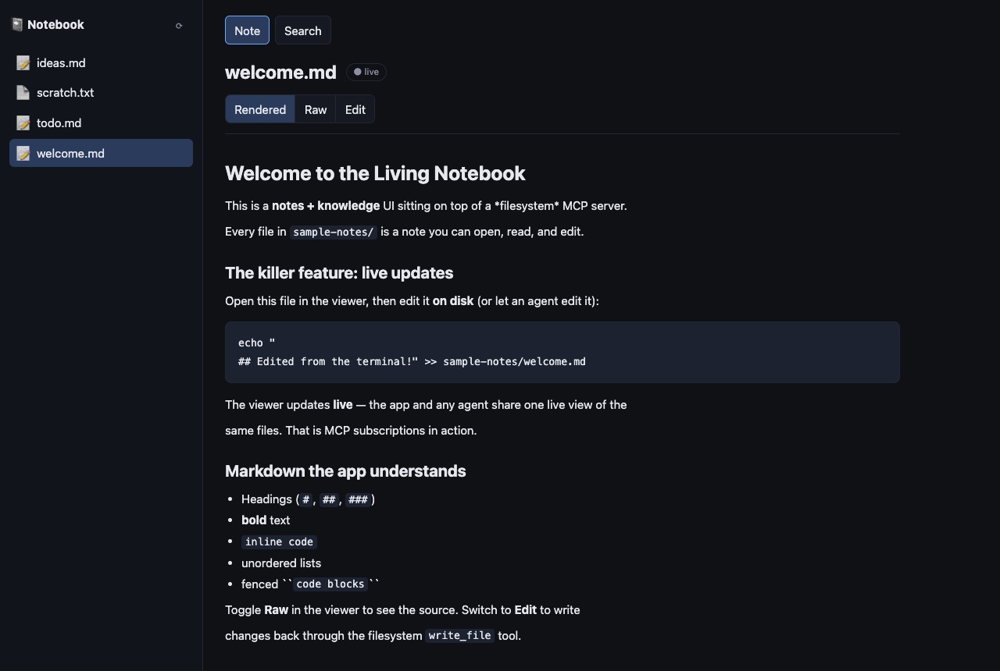
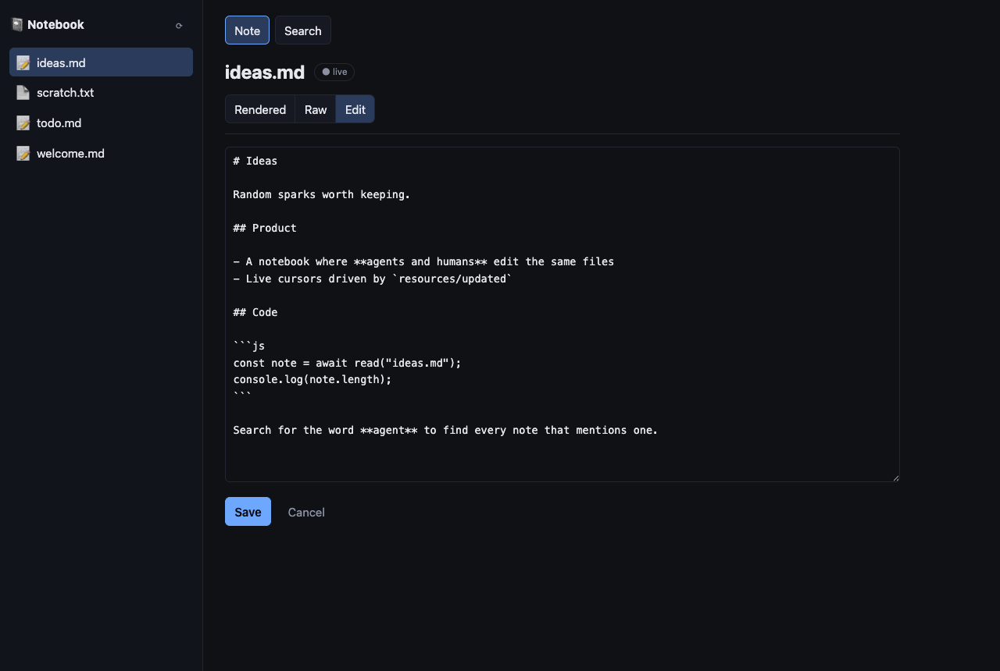
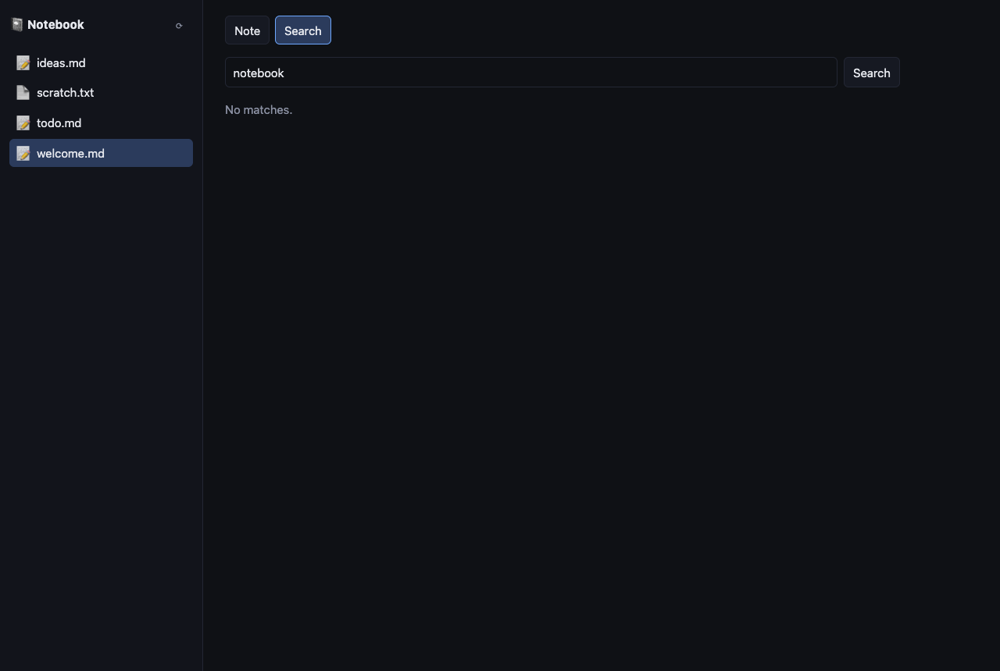

# @mcp-query/notebook — Living Notebook

A notes / knowledge UI built on **mcp-query** over a **filesystem MCP server**. Every file
in [`sample-notes/`](./sample-notes) is a note you can browse, render, search, and edit. The
point of the demo: **the app and an agent (or your terminal) share one live view of the same
files** — edit a note on disk and the open viewer updates by itself.

```
┌──────────┐    WebSocket     ┌───────────────┐    stdio    ┌──────────────────────────────┐
│ browser  │ ───────────────▶ │  dev WS proxy │ ──────────▶ │ @modelcontextprotocol/        │
│ (React)  │   makeProxyClient│ (apps/shared) │   spawns    │ server-filesystem sample-notes│
└──────────┘                  └───────────────┘             └──────────────────────────────┘
```

## Screenshots

**Rendered note** — the file tree (left) and a note rendered to markdown, kept **live**: edit the file on disk and the viewer updates by itself.



**Edit** — write changes back through the filesystem `write_file` tool.



**Search** — find notes by name via `search_files` (glob, e.g. `*.md`).



## Run it

From the repo root (everything is already installed — do **not** run `npm install`):

```bash
npm run dev -w @mcp-query/notebook
```

`dev` starts two processes with `concurrently`:

- **proxy** — `tsx ../shared/src/proxy-cli.ts`, the browser↔MCP WebSocket bridge. It spawns
  `npx -y @modelcontextprotocol/server-filesystem <abs path to sample-notes>` over stdio when
  the browser connects. It prints a **connect URL** with `?proxyToken=…&proxyPort=…`.
- **web** — Vite on http://localhost:5177.

**Open the URL the proxy printed** (it carries the token + port the client needs), e.g.

```
http://localhost:5177/?proxyToken=<token>&proxyPort=6284
```

> The absolute path to `sample-notes/` is baked in at build time (Vite `define`
> `__SAMPLE_NOTES_DIR__`) because the browser can't resolve filesystem paths itself; it hands
> that path to the proxy, which spawns the filesystem server scoped to it.

## What you get

1. **File tree** (left sidebar) — the notes in `sample-notes/`, from the `list_directory`
   tool. Click one to open it. The list polls so files added on disk appear.
2. **Viewer / editor** — opens a file and keeps it **live**:
   - **Rendered** markdown via a tiny hand-rolled renderer (headings, **bold**, `code`,
     lists, fenced blocks — no markdown dependency, everything HTML-escaped).
   - **Raw** toggle for the source.
   - **Edit** mode writes back through the `write_file` tool with an **optimistic update**
     (the saved text shows immediately) plus a confirming re-read, and **rolls back** if the
     write fails.
   - A **● live** pip that **flashes** whenever the on-disk bytes change.
3. **Search** — the `search_files` tool. Note this server matches **file names** (glob), not
   contents: try `*.md` or `*todo*`. Click a result to open it.

## The killer feature — live updates (how to verify)

1. `npm run dev -w @mcp-query/notebook` and open the printed URL.
2. Click **welcome.md** in the sidebar. It renders.
3. In a separate terminal, edit the same file on disk (or let an agent edit it):

   ```bash
   echo '

   ## Edited from the terminal at '"$(date)"'!' >> apps/notebook/sample-notes/welcome.md
   ```

4. Within a second or two the **viewer updates on its own** and the **● live** pip flashes —
   you never touched the app. The app and whoever edited the file share one live view.

### Subscriptions vs. polling (an honest note)

The reference `@modelcontextprotocol/server-filesystem` exposes its files as **tools**
(`list_directory` / `read_text_file` / `write_file` / `edit_file` / `search_files`) and does
**not** implement `resources/list` or `resources/subscribe`. So against this server the
notebook keeps the viewer live by **polling** (`read_text_file` on an interval) — which is
mcp-query's documented real-time fallback for servers without subscribe — and flashes the
same live pip when the bytes change.

The library's true subscription path — `useResource(uri, { subscribe: true })` →
`resources/subscribe` → server emits `resources/updated` → cache invalidation → automatic
re-read — is the killer feature mcp-query exists for. It's exercised end-to-end against a
**subscribe-capable** server in [`test/integration.test.ts`](./test/integration.test.ts).
A subscribe-capable filesystem server would light up that exact path here with no app changes.

## mcp-query APIs used

- `makeProxyClient` / `AppProvider` / `useProxyServersReady` (from `@app-shared`)
- `useTool("list_directory" | "read_text_file" | "write_file" | "search_files", { server })`
  — including `invalidates: ["res:fs:<uri>"]` on `write_file` so any `useResource` subscriber
  re-reads on save.
- The integration test uses `MCPClient`, `MockMCPServer` (`mcp-query/testing`),
  `useResource`-style `readResource(uri, { subscribe: true })`, and
  `mock.notifyResourceUpdated(uri)`.

`useResourceList({ server: "fs" })` returns `[]` for this server (no resources capability),
which is why the tree is tool-driven; the call is harmless and would populate automatically
against a resource-exposing server.

## Develop / verify

```bash
npm run typecheck -w @mcp-query/notebook   # tsc --noEmit
npm test          -w @mcp-query/notebook   # vitest (markdown + fs helpers + live integration)
npm run build     -w @mcp-query/notebook   # vite build
```

## Tests

- `test/markdown.test.ts` — the hand-rolled renderer: headings/bold/code/lists/fenced blocks
  and HTML escaping (no markup injection).
- `test/fs.test.ts` — `list_directory` / `search_files` output parsing.
- `test/integration.test.ts` — **the live path**: a `MockMCPServer` with a resource + a
  `write_file` tool, driven through a real `MCPClient` over an in-memory transport: read +
  subscribe, write + confirm, and `notifyResourceUpdated` → cache invalidation → fresh read.
