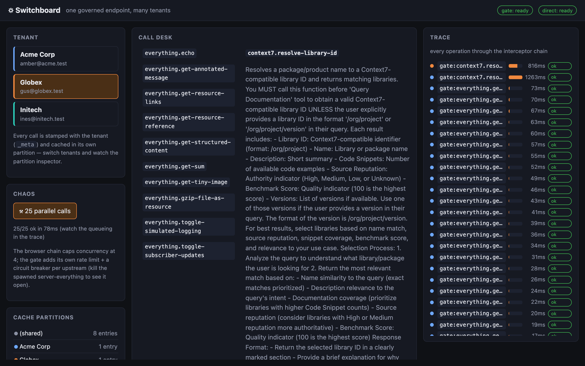

# Switchboard

**One governed endpoint, many tenants** — a gateway ops console: an `@mcp-query/gate`
sidecar fronts local + live remote servers behind declarative policy, while the browser
client runs every call through an interceptor chain, stamps it with a tenant, and caches
it in that tenant's own partition.



This is the app for the server-side half of mcp-query — the features no other app touches:

| Feature | Where |
|---|---|
| `@mcp-query/gate` (→ `createGateway` + `authorize` + `redact` + `rateLimit` + `circuitBreaker`) as a stdio sidecar the WS proxy spawns — zero extra infrastructure | `gate.config.ts` |
| Interceptor chain (`MCPClientConfig.interceptors`), browser-side: tracing → tenant-meta → `rateLimit(4)` | `src/trace.ts`, `src/main.tsx` |
| Multi-tenant `client.scope({ partition, meta })` — per-tenant cache isolation + `_meta` principal propagation (which now traverses the gateway) | `src/components/CallDesk.tsx`, `PartitionInspector.tsx` |
| Governed vs direct: the same Context7 call through the gate (policy'd, redacted) or straight to the ungoverned remote | `CallDesk.tsx` toggle |
| Live remote upstreams behind the gate: Context7 (no token needed) and Hugging Face (`HF_TOKEN`) | `gate.config.ts` |

What to try:

- **Policy is visible**: `everything.get-env` doesn't exist in the catalog (list-filtered);
  destructive tools are listed but denied at call time — watch the denied row in the trace.
- **Redaction**: any result containing an `sk-…` credential arrives as `sk-[REDACTED]`.
- **Chaos**: the ⚒ button fires 25 parallel calls — the browser chain caps concurrency at
  4 and you can watch the queueing in the waterfall. Kill the spawned `server-everything`
  process to watch the gate's circuit breaker open and recover.
- **Tenants**: switch tenants and re-run a call — the partition inspector shows each
  tenant's entries separately; nothing is shared.

## Run

```bash
npm run dev -w @mcp-query/switchboard
# open the printed http://localhost:5180/?proxyToken=…&proxyPort=6287 URL
```

The dev script runs the shared WS proxy alongside Vite. The browser asks the proxy to
spawn `tsx packages/mcp-gate/src/cli.ts gate.config.ts` (the gate over stdio) plus a
direct Streamable-HTTP connection to Context7 for the governed/direct comparison.
Set `SWITCHBOARD_OFFLINE=1` to keep the gate on server-everything alone (no network), or
`HF_TOKEN=…` to add Hugging Face as a third upstream.

## Tests

`npm test -w @mcp-query/switchboard` — integration tests run a real in-process gate
(`createGate` over a linked in-memory transport) fronting `MockMCPServer`, driven through
the app's actual interceptor chain: policy denial + list-filtering, DLP redaction, trace
outcomes, and tenant `_meta`/partition isolation end-to-end.
